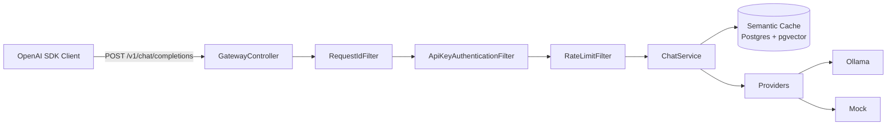

[](https://openjdk.org/projects/jdk/26/)
[](https://spring.io/projects/spring-boot)
[](https://www.postgresql.org/)
[](https://github.com/pgvector/pgvector)
[](https://www.docker.com/)
[](LICENSE)

> OpenAI-compatible API gateway for multi-provider LLM routing with tenant auth, rate limiting, and semantic caching.

## Quick navigation

- [Why this project](#why-this-project)
- [Features](#features)
- [Architecture at a glance](#architecture-at-a-glance)
- [Getting started](#getting-started)
- [Usage examples](#usage-examples)
- [Configuration cheatsheet](#configuration-cheatsheet)
- [Project structure](#project-structure)
- [Roadmap](#roadmap)
- [Known limitations](#known-limitations)

## Why this project

`llmgateway` lets any OpenAI SDK client talk to a single endpoint while the gateway handles:

- provider selection and fallback/race strategies,
- tenant-level authentication,
- tenant-aware rate limiting,
- and response reuse through semantic similarity.

It is a hands-on project to explore Java 26 preview features, Spring Boot 4, Spring Modulith, and AI-focused backend patterns.

## Features

- **OpenAI-compatible endpoint**: `POST /v1/chat/completions`
- **Multi-provider routing strategies**
  - `SEQUENTIAL_FALLBACK`: try providers by priority until one succeeds
  - `PARALLEL_RACE`: query providers concurrently and return first successful answer
- **API-key authentication** (`Authorization: Bearer sk-...`) with tenant identity
- **Rate limiting per tenant** using token bucket (`Bucket4j` + `Caffeine`)
- **Semantic cache** backed by PostgreSQL + `pgvector` and embedding similarity
- **OpenAI-style structured errors** with `request_id` propagation for traceability
- **Modular boundaries** validated with Spring Modulith tests

## Architecture at a glance



### Routing strategy header

Use `X-Gateway-Strategy` to control behavior per request:

- `SEQUENTIAL_FALLBACK` (default)
- `PARALLEL_RACE`

## Getting started

### Prerequisites

- Docker Desktop
- Ollama running locally on `0.0.0.0:11434`
- Models:
  - `nomic-embed-text` (embeddings)
  - `qwen2.5-coder:7b` (or another chat model)
- JDK 26 if running outside containers

### 1) Configure Ollama for external connections (macOS)

```bash
launchctl setenv OLLAMA_HOST "0.0.0.0:11434"
# restart Ollama app
```

### 2) Pull required models

```bash
ollama pull nomic-embed-text
ollama pull qwen2.5-coder:7b
```

### 3) Run locally

```bash
docker-compose up postgres -d
./gradlew bootRun
```

### 4) Smoke test

```bash
curl -X POST http://localhost:8080/v1/chat/completions \
  -H "Content-Type: application/json" \
  -H "Authorization: Bearer sk-test-alice" \
  -d '{
    "model": "qwen2.5-coder:7b",
    "messages": [{"role": "user", "content": "Hello from gateway"}]
  }'
```

### Run everything in Docker

```bash
docker-compose up --build
```

## Usage examples

### Example A: `curl` with routing strategy

```bash
curl -s -X POST http://localhost:8080/v1/chat/completions \
  -H "Authorization: Bearer sk-test-alice" \
  -H "Content-Type: application/json" \
  -H "X-Gateway-Strategy: PARALLEL_RACE" \
  -d '{
    "model": "qwen2.5-coder:7b",
    "messages": [{"role": "user", "content": "Summarize Java structured concurrency in 3 bullets."}]
  }'
```

### Example B: OpenAI Python SDK pointing to this gateway

```python
from openai import OpenAI

client = OpenAI(
    api_key="sk-test-alice",
    base_url="http://localhost:8080/v1",
)

resp = client.chat.completions.create(
    model="qwen2.5-coder:7b",
    messages=[{"role": "user", "content": "Say hello from llmgateway"}],
)

print(resp.choices[0].message.content)
```

### Example C: rate-limit behavior

```bash
for i in {1..11}; do
  curl -s -o /dev/null -w "%{http_code}\n" \
    -X POST http://localhost:8080/v1/chat/completions \
    -H "Authorization: Bearer sk-test-alice" \
    -H "Content-Type: application/json" \
    -d '{"model":"mock-fast","messages":[{"role":"user","content":"hi"}]}'
done
```

Expected pattern (with demo config): first requests `200`, then `429` once limit is exceeded.

### Example D: structured error + request id

```bash
curl -i -X POST http://localhost:8080/v1/chat/completions
```

You should receive an OpenAI-style error body and an `X-Request-Id` response header to correlate logs and response payloads.

## Configuration cheatsheet

Main runtime config: `src/main/resources/application.yaml`

- API keys and tenant mapping: `gateway.security.api-keys`
- Rate limit config: `gateway.rate-limit`
- Provider setup (Ollama/mock): `gateway.providers.*`

## Tech stack

- `Java 26` (preview features enabled)
- `Spring Boot 4.1`
- `Spring Modulith`
- `Spring Security 7.1`
- `Bucket4j` + `Caffeine`
- `Spring AI` + Ollama
- `PostgreSQL 17` + `pgvector`
- `Flyway`
- `Gradle 9`
- `JUnit 5` + `Testcontainers`

## Project structure

```text
src/main/java/com/marcos/llmgateway/
├── gateway/          # API surface + orchestration
├── providers/        # Ollama + Mock adapters
└── cache/            # semantic cache abstractions and implementation
```

## Development commands

```bash
./gradlew build
./gradlew test
./gradlew test --tests "com.marcos.llmgateway.LlmgatewayApplicationTests"
./gradlew bootRun
```

## Roadmap

- [x] REST API + domain model
- [x] Multi-provider routing + structured concurrency
- [x] Authentication + rate limiting + structured errors
- [x] Dockerized local setup
- [ ] Observability stack (Prometheus/Grafana/Loki/Tempo)
- [ ] Event-driven usage metering
- [ ] gRPC endpoint + SDK helpers
- [ ] Broader CI/test harness

## Known limitations

This repository is intended for learning/prototyping scenarios. For known constraints and tradeoffs, see `TECH_DEBT.md`.

## License

MIT