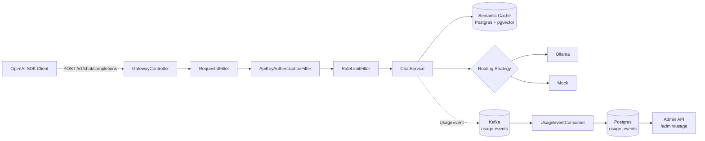

[](https://github.com/MarcosLM11/llmgateway/actions/workflows/ci.yml)
[](https://github.com/MarcosLM11/llmgateway/actions/workflows/ci.yml)
[](https://openjdk.org/projects/jdk/26/)
[](https://spring.io/projects/spring-boot)
[](https://spring.io/projects/spring-ai)
[](https://kafka.apache.org/)
[](https://www.postgresql.org/)
[](https://github.com/pgvector/pgvector)
[](https://grafana.com/)
[](https://www.docker.com/)
[](LICENSE)

> Production-grade OpenAI-compatible API gateway for multi-provider LLM routing with tenant auth, rate limiting, semantic caching, full observability, and event-driven usage metering.

## Quick navigation

- [Why this project](#why-this-project)
- [Features](#features)
- [Architecture at a glance](#architecture-at-a-glance)
- [Observability stack](#observability-stack)
- [Event-driven metering](#event-driven-metering)
- [Getting started](#getting-started)
- [Usage examples](#usage-examples)
- [Configuration cheatsheet](#configuration-cheatsheet)
- [Project structure](#project-structure)
- [Testing & CI](#testing--ci)
- [Roadmap](#roadmap)
- [Known limitations](#known-limitations)

## Why this project

`llmgateway` lets any OpenAI SDK client talk to a single endpoint while the gateway handles:

- provider selection with `SEQUENTIAL_FALLBACK` or `PARALLEL_RACE` strategies powered by **Java 26 structured concurrency**,
- tenant-level authentication and per-tenant token-bucket rate limiting,
- response reuse through semantic similarity over **pgvector** embeddings,
- full observability with Prometheus metrics, Tempo traces, Loki logs and Grafana dashboards (auto-provisioned, with trace ↔ logs correlation),
- and **event-driven usage metering** via Kafka with an admin endpoint for per-tenant aggregates.

It is a hands-on exploration of Java 26 preview features, Spring Boot 4, Spring AI 2.0, Spring Modulith, Jackson 3, and AI-focused backend patterns.

## Features

- **OpenAI-compatible endpoint**: `POST /v1/chat/completions`
- **Multi-provider routing strategies**
  - `SEQUENTIAL_FALLBACK`: try providers by priority until one succeeds
  - `PARALLEL_RACE`: query providers concurrently and return first successful answer
  - Both powered by **Java 26 structured concurrency** (preview)
- **API-key authentication** (`Authorization: Bearer sk-...`) with tenant identity and admin role
- **Rate limiting per tenant** using token bucket (`Bucket4j` + `Caffeine`)
- **Semantic cache** backed by PostgreSQL + `pgvector` with cosine similarity threshold
- **OpenAI-style structured errors** with `X-Request-Id` propagation for traceability
- **Observability stack**: Prometheus metrics, Tempo traces, Loki logs, Grafana dashboards with trace↔log correlation
- **Event-driven metering**: per-request `UsageEvent` published to Kafka, consumed and persisted asynchronously
- **Admin API**: `GET /admin/usage?tenantId=...` for per-tenant aggregates (requests, cache hits, tokens, latency by model)
- **Modular boundaries** validated with Spring Modulith tests (zero cycles, internal types not leaked across modules)
- **CI pipeline** with Testcontainers-backed integration tests and 78% Jacoco coverage

## Architecture at a glance



### Routing strategy header

Use `X-Gateway-Strategy` to control behavior per request:

- `SEQUENTIAL_FALLBACK` (default)
- `PARALLEL_RACE`

## Observability stack

All telemetry signals are exported via OpenTelemetry and visualized in Grafana with **trace ↔ logs correlation** out of the box.

| Signal       | Backend        | Port  |
|--------------|----------------|-------|
| Metrics      | Prometheus     | 9090  |
| Traces       | Tempo          | 3200  |
| Logs         | Loki           | 3100  |
| Dashboards   | Grafana        | 3000  |

Grafana ships with auto-provisioned datasources and a dashboard exposing:

- Cache hit rate
- Provider latency P95
- Request throughput
- Tokens/sec by provider

Click a span in Tempo → jump to the matching log line in Loki via the `trace_id` derived field. Click a `trace_id` in a Loki log → open the corresponding trace in Tempo.

Anonymous viewer access enabled by default; admin login (`admin/admin`) only required for Connections / Administration sections.

## Event-driven metering

Every chat request emits a `UsageEvent` to the `usage-events` Kafka topic:

```json
{
  "requestId": "uuid",
  "tenantId": "alice-corp",
  "model": "qwen2.5-coder:7b",
  "provider": "ollama",
  "promptTokens": 30,
  "completionTokens": 17,
  "cacheHit": false,
  "latencyMs": 2562,
  "timestamp": "2026-06-23T17:01:14Z"
}
```

A dedicated consumer persists events to PostgreSQL with **idempotency guarantees** (`INSERT ... ON CONFLICT (request_id) DO NOTHING`). The admin endpoint exposes aggregates:

```bash
curl -H "Authorization: Bearer sk-admin-master" \
     "http://localhost:8080/admin/usage?tenantId=alice-corp"
```

```json
{
  "tenantId": "alice-corp",
  "totalRequests": 5,
  "cacheHits": 4,
  "cacheHitRate": 0.8,
  "totalPromptTokens": 150,
  "totalCompletionTokens": 85,
  "totalTokens": 235,
  "avgLatencyMs": 2562,
  "byModel": [
    { "model": "qwen2.5-coder:7b", "requests": 5, "totalTokens": 235 }
  ]
}
```

Cache hits emit events with `provider="cache"` and `latencyMs` reflecting gateway end-to-end latency, not provider call time.

## Getting started

### Prerequisites

- Docker Desktop
- Ollama running locally on `0.0.0.0:11434`
- Models:
  - `nomic-embed-text` (embeddings)
  - `qwen2.5-coder:7b` (or another chat model)
- JDK 26 if running outside containers

### 1) Configure Ollama for external connections (macOS)

```bash
launchctl setenv OLLAMA_HOST "0.0.0.0:11434"
# restart Ollama app
```

### 2) Pull required models

```bash
ollama pull nomic-embed-text
ollama pull qwen2.5-coder:7b
```

### 3) Run the full stack

```bash
docker compose up -d
./gradlew bootRun
```

This brings up Postgres, Kafka (KRaft mode), Prometheus, Tempo, Loki, and Grafana. The Spring Boot app then starts on `localhost:8080`.

### 4) Smoke test

```bash
curl -X POST http://localhost:8080/v1/chat/completions \
  -H "Content-Type: application/json" \
  -H "Authorization: Bearer sk-test-alice" \
  -d '{
    "model": "qwen2.5-coder:7b",
    "messages": [{"role": "user", "content": "Hello from gateway"}]
  }'
```

### 5) Open Grafana

Navigate to [http://localhost:3000](http://localhost:3000). The "LLM Gateway Overview" dashboard is auto-loaded.

### Run everything in Docker

```bash
docker compose up --build
```

## Usage examples

### Example A: `curl` with routing strategy

```bash
curl -s -X POST http://localhost:8080/v1/chat/completions \
  -H "Authorization: Bearer sk-test-alice" \
  -H "Content-Type: application/json" \
  -H "X-Gateway-Strategy: PARALLEL_RACE" \
  -d '{
    "model": "qwen2.5-coder:7b",
    "messages": [{"role": "user", "content": "Summarize Java structured concurrency in 3 bullets."}]
  }'
```

### Example B: OpenAI Python SDK pointing to this gateway

```python
from openai import OpenAI

client = OpenAI(
    api_key="sk-test-alice",
    base_url="http://localhost:8080/v1",
)

resp = client.chat.completions.create(
    model="qwen2.5-coder:7b",
    messages=[{"role": "user", "content": "Say hello from llmgateway"}],
)

print(resp.choices[0].message.content)
```

### Example C: rate-limit behavior

```bash
for i in {1..11}; do
  curl -s -o /dev/null -w "%{http_code}\n" \
    -X POST http://localhost:8080/v1/chat/completions \
    -H "Authorization: Bearer sk-test-alice" \
    -H "Content-Type: application/json" \
    -d '{"model":"mock-fast","messages":[{"role":"user","content":"hi"}]}'
done
```

Expected pattern (with demo config): first requests `200`, then `429` once limit is exceeded.

### Example D: query usage metering

```bash
curl -H "Authorization: Bearer sk-admin-master" \
     "http://localhost:8080/admin/usage?tenantId=alice-corp"
```

### Example E: structured error + request id

```bash
curl -i -X POST http://localhost:8080/v1/chat/completions
```

You should receive an OpenAI-style error body and an `X-Request-Id` response header to correlate logs and response payloads.

## Configuration cheatsheet

Main runtime config: `src/main/resources/application.yml`

- API keys and tenant mapping (with admin role): `gateway.security.api-keys`
- Rate limit config: `gateway.rate-limit`
- Provider setup (Ollama / mock): `gateway.providers.*`
- Cache similarity threshold: `cache.similarity-threshold`
- Kafka topics and consumer group: `spring.kafka.*`
- Observability exporters: `management.opentelemetry.*`

## Tech stack

- `Java 26` (with Structured Concurrency preview)
- `Spring Boot 4.1`
- `Spring Modulith 2.1`
- `Spring AI 2.0` + Ollama
- `Spring Security 7.1`
- `Spring Kafka` (KRaft mode)
- `Jackson 3` (`tools.jackson.*`)
- `Bucket4j` + `Caffeine`
- `PostgreSQL 17` + `pgvector`
- `Flyway`
- `Gradle 9`
- `JUnit 5` + `Testcontainers 2.0` + `Awaitility`
- `Jacoco 0.8.14`
- `OpenTelemetry` + Prometheus + Tempo + Loki + Grafana
- `GitHub Actions` (CI)

## Project structure

The project enforces module boundaries via Spring Modulith. Each module exposes a public API and hides its `internal` types:

```text
src/main/java/com/marcos/llmgateway/
├── gateway/          # API surface + orchestration (ChatService, routing)
│   ├── ChatRequest, ChatResponse, Message, Role, Usage, LlmProvider  (public)
│   └── internal/     # ChatService, controllers, filters, security, rate limit
├── providers/        # LLM provider adapters
│   ├── ollama/       # OllamaLlmProvider, OllamaEmbeddingService
│   └── mock/         # MockLlmProvider (for testing/demo)
├── cache/            # Semantic cache abstractions
│   ├── SemanticCache, EmbeddingService  (public interfaces)
│   └── internal/     # PgVectorSemanticCache
└── metering/         # Event-driven usage metering
    ├── UsageEvent, UsageEventPublisher  (public)
    └── internal/     # Kafka consumer, repository, admin web
```

Module dependencies (no cycles):

gateway ──> cache

gateway ──> metering

providers ──> gateway (LlmProvider)

providers ──> cache   (EmbeddingService)

## Testing & CI

- **15 tests, 78% line coverage** across 4 test classes:
  - `ChatServiceTest`: 9 unit tests covering all routing strategies, cache HIT/MISS, usage event emission
  - `E2EIntegrationTest`: full request lifecycle (REST → cache → provider → Kafka → DB → admin endpoint) with Testcontainers
  - `PgVectorSemanticCacheIT`: cache behaviors with real Postgres + pgvector
  - `LlmgatewayApplicationTests`: Modulith verifies module boundaries
- **Testcontainers** (Postgres + Kafka) shared via `AbstractIntegrationTest` base class
- **Stub embedding** keeps integration tests deterministic and Ollama-free in CI
- **GitHub Actions** runs the full build (`./gradlew clean build`) on push and PR, uploads test and coverage reports as artifacts

Run locally:

```bash
./gradlew clean test                          # all tests
./gradlew test --tests "*E2EIntegrationTest"  # full E2E only
./gradlew jacocoTestReport                    # coverage HTML
./gradlew check                               # tests + coverage threshold
```

## Development commands

```bash
./gradlew build
./gradlew bootRun
./gradlew test
./gradlew jacocoTestReport
docker compose up -d              # full stack (Postgres, Kafka, Grafana stack)
docker compose down -v            # tear down + wipe volumes
```

## Roadmap

- [x] **Phase 1** REST API + domain model
- [x] **Phase 2** Multi-provider routing + Java 26 structured concurrency
- [x] **Phase 3** Authentication + rate limiting + structured errors
- [x] **Phase 3.5** Dockerized local setup
- [x] **Phase 4** Semantic cache (Postgres + pgvector)
- [x] **Phase 5** Observability stack (Prometheus/Tempo/Loki/Grafana with trace↔log correlation)
- [x] **Phase 6** Event-driven usage metering (Kafka + admin endpoint)
- [x] **Phase 7** Test harness + CI (Testcontainers, Jacoco, GitHub Actions)

## Known limitations

This repository is intended for learning/prototyping scenarios. For known constraints and tradeoffs, see [`TECH_DEBT.md`](TECH_DEBT.md).

## License

MIT